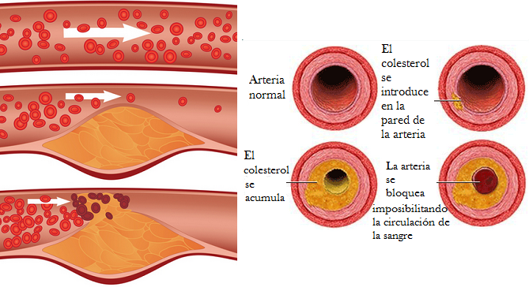
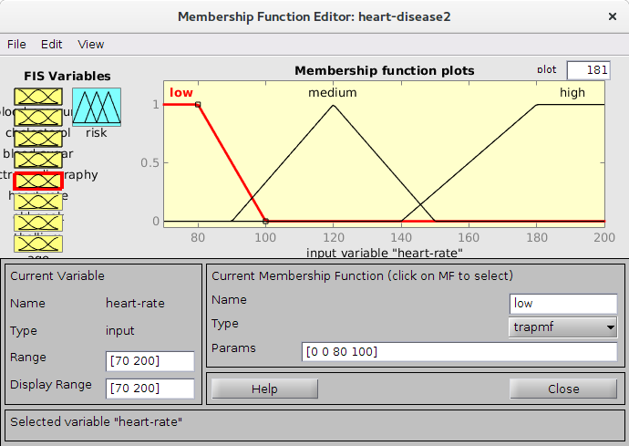
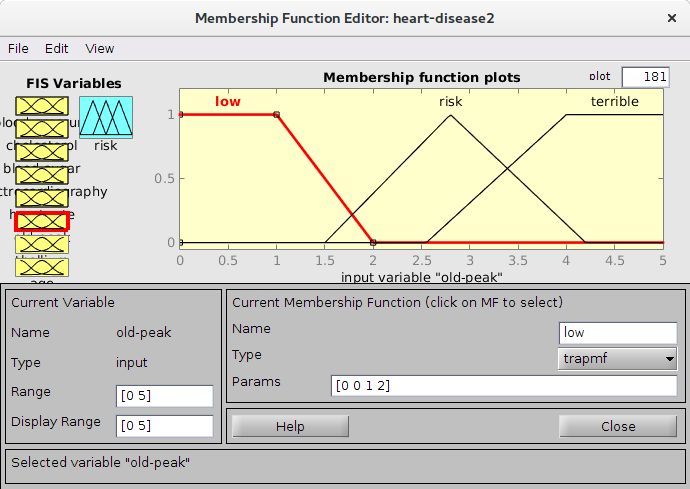
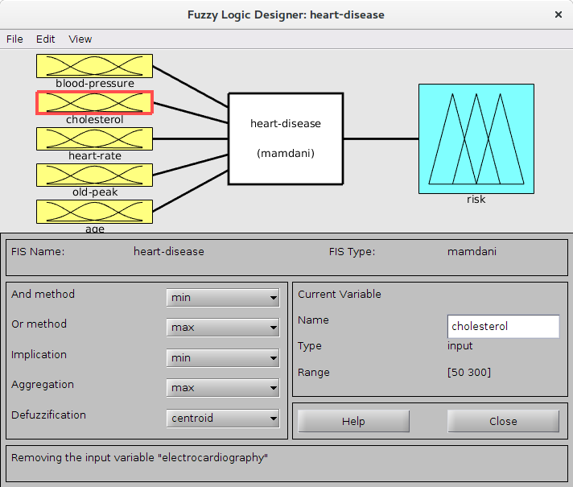

# Lógica difusa aplicada al diagnóstico médico

> Francisco Javier Bolívar Lupiáñez

## Introducción

En la medicina los médicos usan a veces variables precisas como pueden ser el peso, la altura, la frecuencia cardiaca en reposo, pero en la mayoría de las ocasiones usa otras con más vaguedad como puede ser el grado de dolor de cabeza que sufre el paciente, el ejercicio que realiza diariamente e incluso algunas de las variables precisas mencionadas anteriormente como la frecuencia cardiaca o la edad. Porque un individuo con 30 años ¿es una persona joven o empieza a ser considerado mayor?

Es por esto que la aplicación de la lógica difusa en este campo ha tenido bastante importancia que se ve reflejada en el número de papers que se publican sobre esto [1]:

| Año  | Publicaciones |
| ---- | ------------- |
| 2000 | 96            |
| 2001 | 151           |
| 2002 | 119           |
| 2003 | 141           |
| 2004 | 182           |
| 2005 | 194           |
| 2006 | 277           |
| 2007 | 253           |
| 2008 | 290           |
| 2009 | 312           |
| 2010 | 306           |

## Proceso

El proceso de un sistema difuso cuenta con los siguiente pasos [2]:

## Un caso práctico. Diagnóstico de riesgo de enfermedad cardíaca

La medicina es un campo muy extenso y como se ha mencionado anteiormente el número de publicaciones que hacen uso de la lógica difusa para realizar un diagnóstico médico es enorme. De entre todas las posibilidades que he encontrado y decidido profundizar en un caso que se repite en dos publicaciones [3,4] ya que tengo la posibilidad de reproducirlo usando el *toolbox* de *Fuzzy Logic Designer* de MatLab para aprovechar y poder experimentar de forma práctica con la lógica difusa.

Se ha usado un *dataset* basado en los datos obtenidos en el V. A. Medical Center en Long Beach y la Cleveland Clinic Foundation y clasificados por la Universidad de California.

El propósito de este dataset es diagnosticar la presencia o ausencia de riesgo de enfermedad cardiaca que pueda tener un paciente. Originalmente el *dataset* contaba con 76 variables y 303 pacientes, pero para desarrollar este sistema difuso se han utilizado tan solo las seis más significativas (5 de entrada y 1 de salida).

Las variables de entrada son:

| Variable                  | Unidad de medida |
| ------------------------- | ---------------- |
| Presión arterial          | mmHg             |
| Colesterol LDL            | mg/dl            |
| Frecuencia cardiaca       | latidos/m        |
| Depresión del segmento ST | mV               |
| Edad                      | años             |

Y el de salida indica el porcentaje de riesgo de enfermedad cardiaca del individuo.

El objetivo es poder diagnosticar el riesgo de una persona de que sufra una enfermedad cardiaca a corto-medio plazo usando variables que tienen bastante influencia. Porque no es algo que se pueda determinar con precisión teniendo solo en cuenta el colesterol la presión arterial o la frecuencia cardiaca media.

### Fuzzificar

El primer paso de todos es definir las *membership function* de cada variable para convertirlas en números difusos. Tenemos que convertir los valores obtenidos a objetos que se encuentran en uno o varios conjuntos con un grado de pertenencia. Por ejemplo:

* 170 mmHG es una presión media con grado 0,13 y alta con grado 0,94.
* 192 mg/dl de colesterol en sangre es un nivel bajo con grado 0,11 y medio con grado 0,07.

Para obtener estos grados de pertenencia se utilizarán las funciones de membresía que se explicarán posteriormente.

#### Entradas

Son todos los parámetros de entrada de un paciente que se *fuzzifican* como se determina a continuación:

##### Presión arterial sistólica

Cuando el corazón late se producen dos movimientos. La sístole, cuando se contrae, y la diástole, cuando se dilata.

A la hora de medir la presión arterial con un tensiómetro obtenemos dos valores, comunmente llamados alto y bajo. El alto es el que usaremos y es el valor máximo de presión arterial cuando el corazón realiza la sístole. Se mide en milímetros de mercurio (mmHg).

La dividimos en cuatro valores difusos:

##### Colesterol LDL

Uno de los mayores riesgos de sufrir un ataque al corazón es la presencia de un alto nivel de colesterol LDL (*low-density lipoprotein*) en sangre. Ya que bloquea las paredes arteriales impidiendo la circulación de la sangre.

Una mayor cantidad de colesterol LDL se traduce en mayor riesgo de sufrir un ataque al corazón. Se mide en miligramos por decilitro de sangre (mg/dl).

Lo dividimos en cuatro valores difusos:

##### Frecuencia cardíaca

La frecuencia cardíaca es cuántas veces late el corazón por minuto. La media en reposo se encuentra entre 60 y 100 latidos por minuto. Cuando se realiza ejercicio incrementan los latidos linealmente y determinan la forma cardiorespiratoria de una persona.

Lo dividimos en tres valores difusos:

##### Depresión del segmento ST

El electrocardiograma (ECG) es la representación de la actividad eléctrica del corazón. Se obtiene con ultrasonido usando un electrocardiógrafo.

Medir la depresión del segmento ST durante el ejercicio puede ayudar a pronosticar una enfermedad del corazón. A mayor sea este, más posibilidades de sufrir un ataque al corazón. Se mide en mili voltios (mV).

Se usarán tres variables difusas:

##### Edad

A más años tenga un individuo, mayor es la probabilidad de que sufra un ataque cardíaco.

Se usarán cuatro variables difusas:

#### Salida

El sistema proveerá una única salida con el porcentaje de riesgo de ataque.

Para ello se usarán cinco variables difusas:

### Mecanismo de inferencia

Se utiliza el método de Mamdani como mecanismo de inferencia difuso ya que es el que proporciona MatLab. Este método tiene una estructura bastante simple con operaciones *min-max*:

* *OR*: max
* *AND*: min
* Agregación: max
* Implicación: min

#### Reglas

Este mecanismo se basa en la definición de reglas de relaciones difusas. Por ejemplo: "Si la presión sanguínea es muy alta el riesgo es muy alto". A cada una de las reglas se le aplica un peso que determina el grado de validez de ésta.

Las reglas han sido creadas teniendo en cuenta tanto los resultados del *dataset* como por las opiniones de expertos.

### Defuzzificar

Para obtener un resultado en forma de porcentaje y no en forma de variable difusa hay que defuzzificar, para ello, se utiliza el método de centroide. Es un método muy simple que calcula el centro del área obtenida tras aplicar las reglas a los datos de entrada.

### Ejemplos de salidas

Ya que los datos utilizados para la creación de este sistema difuso no han sido publicados, no he podido comprobar el éxito de este con datos reales. No obstante lo he probado con datos

| Edad | Presión | Colesterol | Frecuencia cardiaca | Depresión segmento ST | Riesgo (fuzzy) | Riesgo (matemático) |
| ---- | ------- | ---------- | ------------------- | --------------------- | -------------- | ------------------- |
| 71   | 120     | 265        | 130                 | 0.24                  | 40             | 32                  |
| 49   | 130     | 188        | 139                 | 2                     | 40             | 28                  |
| 54   | 135     | 129        | 126                 | 0.1                   | 10             | 8                   |
| 59   | 140     | 187        | 152                 | 0.1                   | 20             | 17                  |
| 57   | 128     | 229        | 150                 | 0.14                  | 40             | 24                  |
| 61   | 122     | 260        | 170                 | 3.6                   | 60             | 53                  |
| 39   | 165     | 219        | 150                 | 1.2                   | 60             | 48                  |
| 61   | 145     | 277        | 186                 | 1                     | 60             | 61                  |
| 56   | 125     | 249        | 144                 | 1.2                   | 40             | 41                  |
| 45   | 130     | 164        | 135                 | 0.16                  | 20             | 13                  |
| 56   | 190     | 288        | 153                 | 4                     | 100            | 121                 |
| 54   | 160     | 239        | 146                 | 1.8                   | 60             | 57                  |
| 41   | 120     | 200        | 130                 | 0.1                   | 20             | 16                  |
| 61   | 124     | 209        | 163                 | 0.1                   | 20             | 18                  |
| 58   | 120     | 258        | 137                 | 0.14                  | 20             | 28                  |
| 51   | 122     | 227        | 124                 | 0.1                   | 20             | 21                  |
| 29   | 130     | 204        | 202                 | 0.1                   | 20             | 20                  |
| 51   | 140     | 241        | 186                 | 0.1                   | 20             | 29                  |
| 43   | 122     | 213        | 165                 | 0.12                  | 20             | 20                  |
| 57   | 167     | 299        | 164                 | 1                     | 80             | 85                  |

## Conclusiones

Lala

## Referencias

1. Patel, A., Gupta, S. K., Rehman, Q., & Verma, M. K. (2013). Application of Fuzzy Logic in Biomedical Informatics. *Journal of Emerging Trends in Computing and Information Sciences, 4*(1), 57-62.
2. Tarhini, A., Kočiš, L'. (1998). Fuzzy Approach in Psychiatry. *Psychiatria*, 80-86.
3. Sikchi, S. S., Sikchi, S., & Ali, M. S. (2013). Generic medical fuzzy expert system for diagnosis of cardiac diseases. *International Journal of Computer Applications, 66*(13).
4. Adeli, A., & Neshat, M. (2010, March). A fuzzy expert system for heart disease diagnosis. In *Proceedings of International Multi Conference of Engineers and Computer Scientists, Hong Kong* (Vol. 1).
